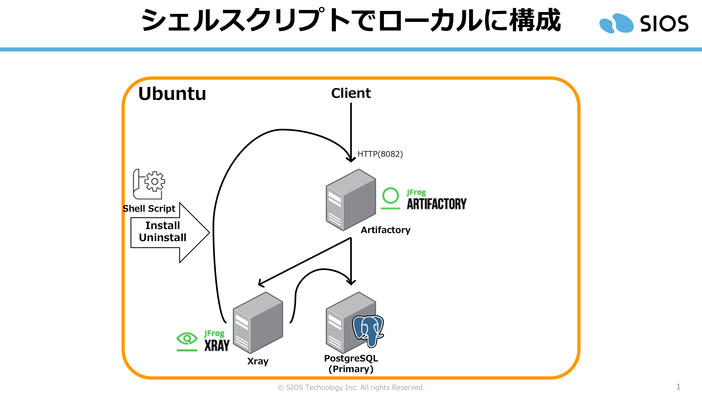
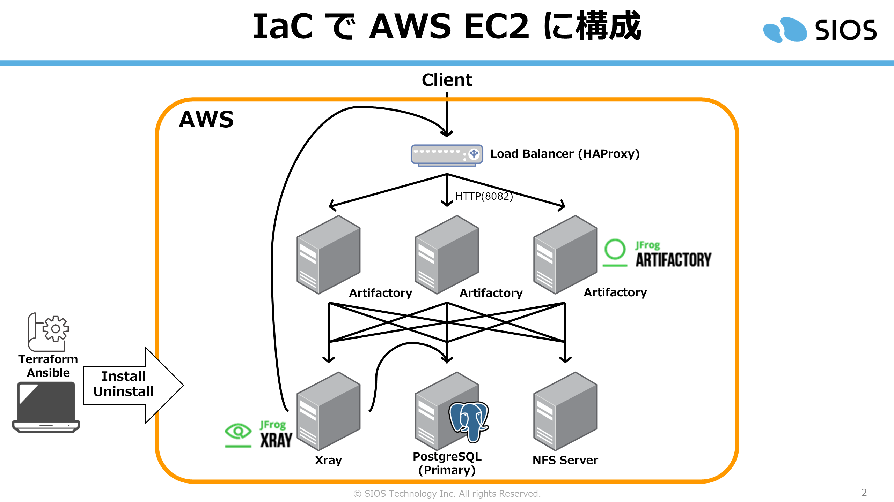

# Artifactory Pro インストール体験

## 素材紹介

- Case 1: [シェルスクリプトでローカルマシーンで構築](./shellscript-for-local-machine/)
- Case 2: [IaC で AWS の EC2 へ構築](./iac-for-aws-ec2/)

<table>
<tr><th width="50%">Case 1</th><th width="50%">Case 2</th></tr>
<tr>
<td width="50%" style="text-align: center"></td>
<td width="50%" style="text-align: center"></td></tr>
<tr><td>各コンポーネントはプロセス単位</td><td>各コンポーネントはEC2単位</td></tr>
</table>

## 参考資料

- https://jfrog.com/help/r/jfrog-installation-setup-documentation/install-artifactory-on-debian
- https://jfrog.com/help/r/jfrog-installation-setup-documentation/create-the-artifactory-postgresql-database
- https://jfrog.com/help/r/jfrog-installation-setup-documentation/xray-single-node-manual-debian-installation
- https://jfrog.com/help/r/jfrog-installation-setup-documentation/create-the-xray-postgresql-database
