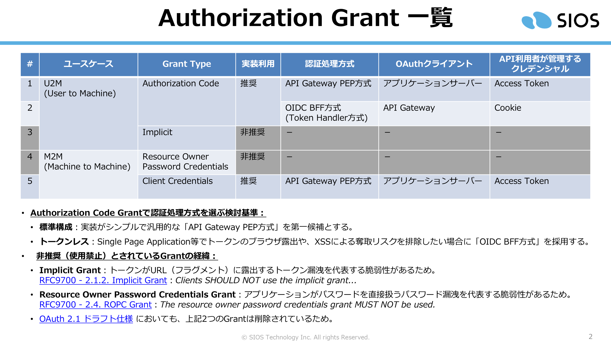
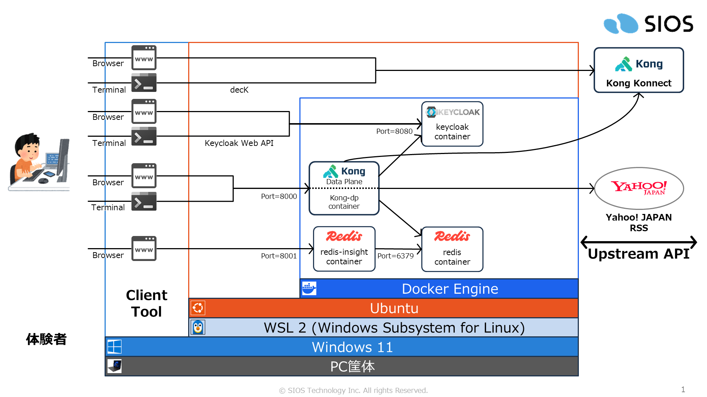
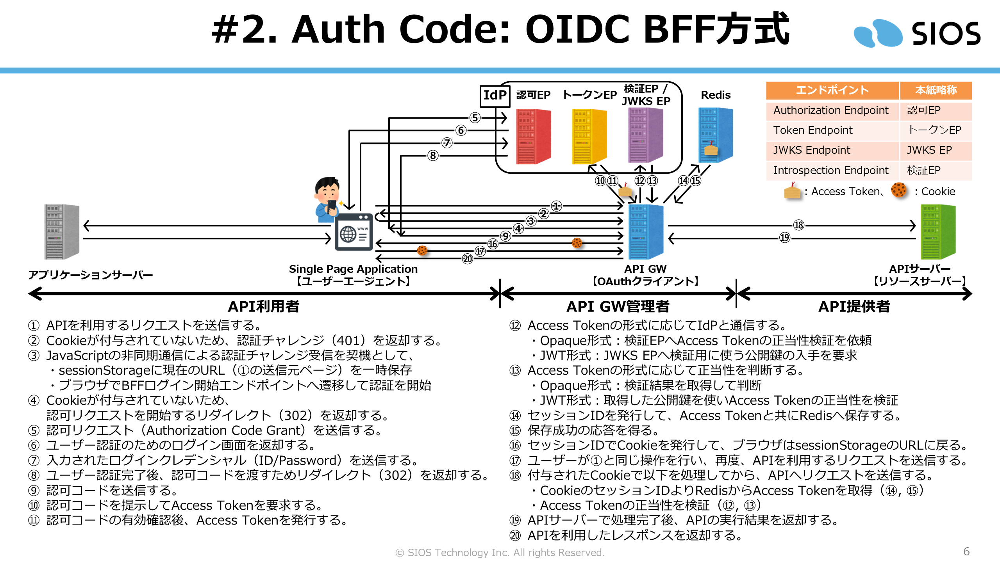
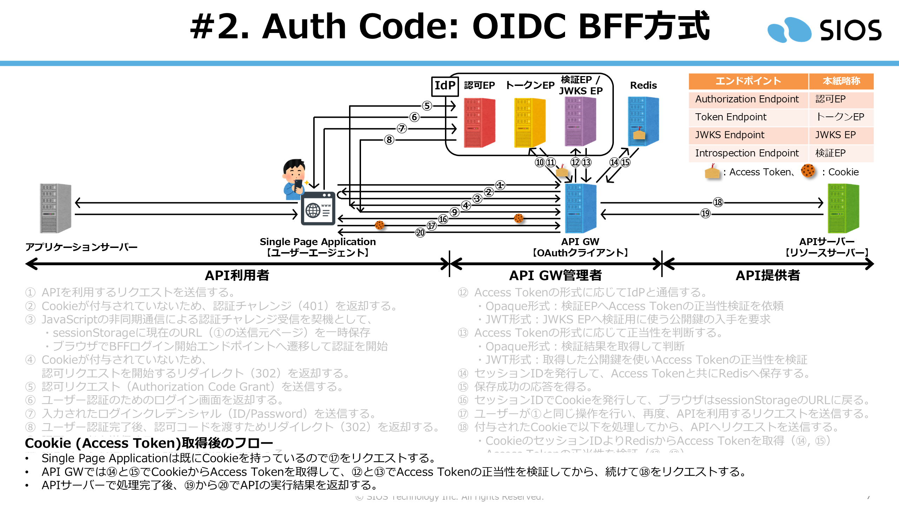
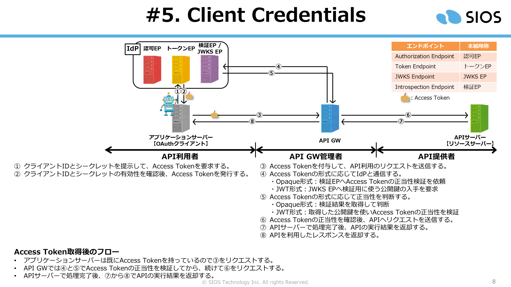

# API Gateway 認可アーキテクチャ体験

## はじめに

Kong Konnect と Keycloak を使い、主要な認可フローを体験するための環境です。標準的な PEP 方式やトークンを秘匿する BFF 方式など、構成による挙動の差をスクリプトで比較しながら体系的に体験できます。



体験を進める環境は以下の通りです。



## 体験環境の構築手順

### 事前準備

Kong Konnectにアクセスして事前準備をします。

1. 「Control Plane」を作り、該当のリージョンと名称を手元に控えておきます。

1. 「Personal Access Token」を発行して手元に控えておきます。

ローカル環境で事前準備をします。

1. dockerをインストールします。
   - [初期環境構築: Docker Engine on Ubuntu](https://github.com/Toshiharu-Konuma-sti/setup-docs-for-hands-on/tree/main/setup-docker-engine-on-ubuntu)

1. decKをインストールします。

   - https://developer.konghq.com/deck/
     ```
	 $ curl -LO https://github.com/Kong/deck/releases/download/v1.55.0/deck_v1.55.0_amd64.deb
     $ sudo dpkg -i ./deck_v1.55.0_amd64.deb
     $ deck version
       decK v1.55.0 (19a389c)
     ```
1. hostsにkeycloakを登録する
   - Windows:    C:\Windows\System32\driversc\hosts
   - Linux(WSL): /etc/hosts
   - MacOS:      /private/etc/hosts
     ```
     127.0.0.1 keycloak
     ```

1. リポジトリを取得します。

    ```
	$ mkdir -p ~/handson/
    $ cd ~/handson/
    ```
    ```
    $ git clone https://github.com/Toshiharu-Konuma-sti/my-skilling.git
	$ cd ~/handson/my-skilling/kong-konnect/aouth-autorization-grant/
    ```

### コンテナ構築

1. コンテナ構築用のディレクトリに移ります。スクリプトは2つあるため実行前に処理概要を理解します。

    ```
    $ cd ~/handson/container/
    ```
	- [BEFORE_CREATE_CONTAINER.sh](./container/BEFORE_CREATE_CONTAINER.sh)：Kong Data Plane認証用のクライアント証明書および秘密鍵の作成とKonnectへ登録します。
	- [CREATE_CONTAINER.sh](./container/CREATE_CONTAINER.sh)：コンテナを構築します。

1. コンテナ構築前の事前準備スクリプトを実行します。体験で利用するKonnectのリージョン、Control Plane名、Konnectを操作するためのPersonal Access Tokenを求められたら入力します。

    ```
	$ ./BEFORE_CREATE_CONTAINER.sh

    🏢 Enter REGION (Control Plane Region): us
    🏢 Enter CP_NAME (Control Plane Name): my-test-cp001
    🔑 Enter KONNECT_PAT (Secret):
	############################################################
	# START SCRIPT
	############################################################
	  :
    ```

1. コンテナ構築スクリプトを実行します。

    ```
	$ ./CREATE_CONTAINER.sh

	############################################################
	# START SCRIPT
	############################################################
	  :
    ```


### Keycloak 環境設定

1. 環境設定用のディレクトリに移ります。

    ```
    $ cd ~/handson/setup/
    ```

1. 環境設定スクリプトを実行します。

    ```
	$ ./step01_SETUP_KEYCLOAK.sh

	############################################################
	# START SCRIPT
	############################################################
	  :
    ```

### Kong Konnect 環境設定

1. 環境設定用のディレクトリに移ります。

    ```
    $ cd ~/handson/setup/
    ```

1. 環境設定スクリプトを実行します。

    ```
	$ ./step02_KONG_REGISTER_API.sh

    🏢 Enter REGION (Control Plane Region): us
    🏢 Enter CP_NAME (Control Plane Name): my-test-cp001
    🔑 Enter KONNECT_PAT (Secret):
	############################################################
	# START SCRIPT
	############################################################
	  :
    ```

## 体験

1. 体験用のディレクトリに移ります。

    ```
    $ cd ~/handson/try-my-hand/
    ```

### Authorization  Code Grant: API Gateway PEP方式


本Grantを体験するために、事前に以下OASをKong Konnect環境構築で適用しています。

- [oauth-auth-code-api-gw-pep-oas.yaml](./setup/oauth-auth-code-api-gw-pep-oas.yaml)

図に示したAccess Token発行フローを、curlコマンドを用いたスクリプトで体験することができます。

- [test01_auth-code-api-gw-pep.sh](./try-my-hand/test01_auth-code-api-gw-pep.sh)

  ```
  $ ./test01_auth-code-api-gw-pep.sh
  ```

### Authorization  Code Grant: OIDC BFF方式





本Grantを体験するために、事前に以下OASをKong Konnect環境構築で適用しています。

- [oauth-auth-code-oidc-bff-oas.yaml](./setup/oauth-auth-code-oidc-bff-oas.yaml)
- [oauth-bff-login-oas.yaml](./setup/oauth-bff-login-oas.yaml)

図に示したAccess Token発行フローを、curlコマンドを用いたスクリプトで体験することができます。

- [test02_auth-code-oidc-bff.sh](./try-my-hand/test02_auth-code-oidc-bff.sh)

  ```
  $ ./test02_auth-code-oidc-bff.sh
  ```

### Client Credentials



本Grantを体験するために、事前に以下OASをKong Konnect環境構築で適用しています。

- [oauth-client-credentials-oas.yaml](./setup/oauth-client-credentials-oas.yaml)

図に示したAccess Token発行フローを、curlコマンドを用いたスクリプトで体験することができます。

- [test03_client-credentials.sh](./try-my-hand/test03_client-credentials.sh)

  ```
  $ ./test03_client-credentials.sh
  ```

## 清掃手順

1. 環境構築用のディレクトリに移ります。

    ```
    $ cd ~/handson/setup/
    ```

1. Konnectからルートとサービスの削除スクリプトを実行します。

    ```
	$ ./step09_KONG_CLEANUP_ROUTE_SERVICE.sh

    🏢 Enter REGION (Control Plane Region): us
    🏢 Enter CP_NAME (Control Plane Name): my-test-cp001
    🔑 Enter KONNECT_PAT (Secret):
	############################################################
	# START SCRIPT
	############################################################
	  :
    ```

1. コンテナ構築用のディレクトリに移ります。

    ```
    $ cd ~/handson/container/
    ```

1. コンテナ停止スクリプトを実行します。

    ```
	$ ./CREATE_CONTAINER.sh down

	############################################################
	# START SCRIPT
	############################################################
	  :
    ```

1. ローカル環境のhostsに登録したkeycloakを解除する
    ```
    # 127.0.0.1 keycloak
    ```
