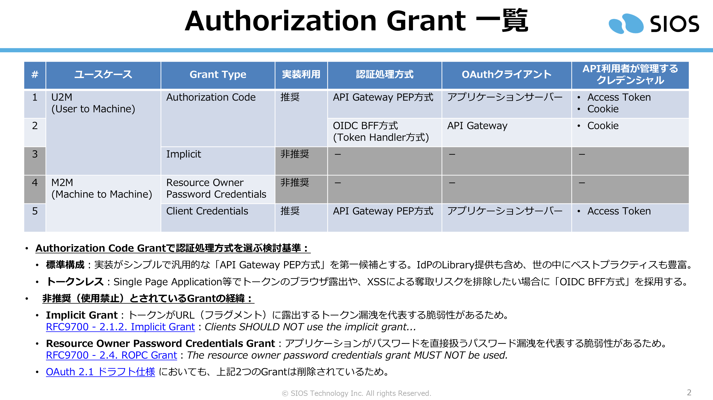
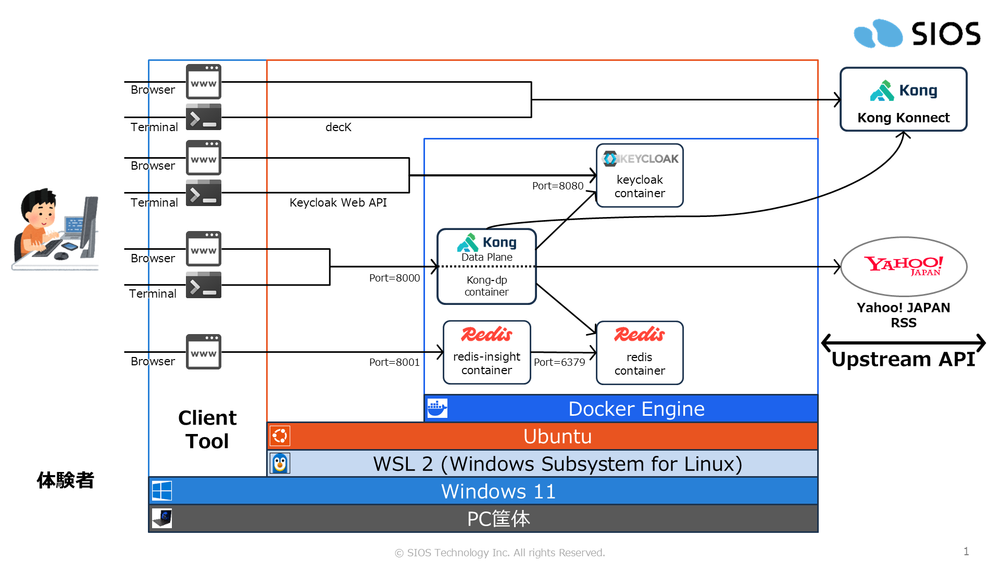
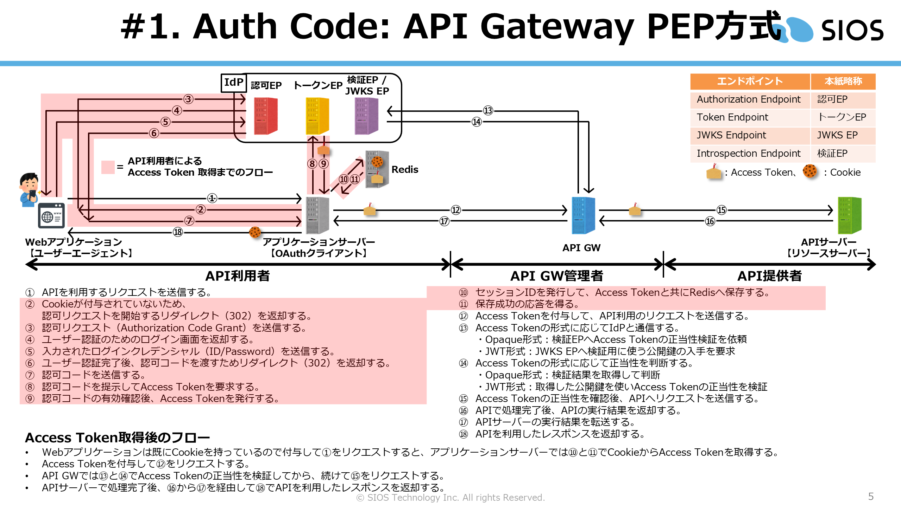
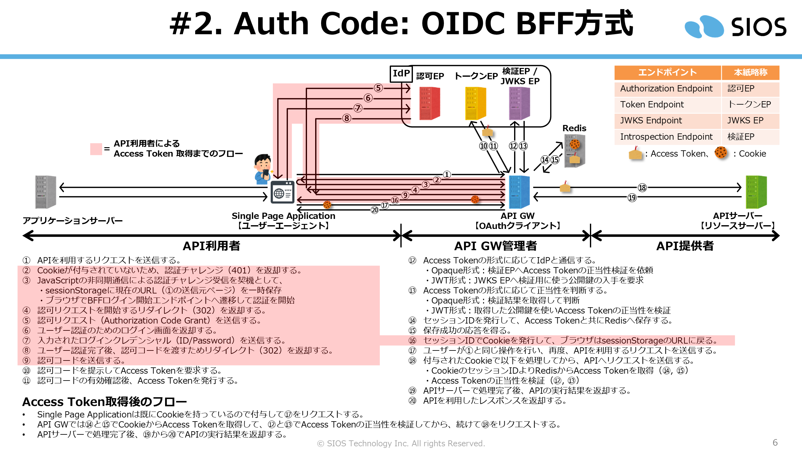
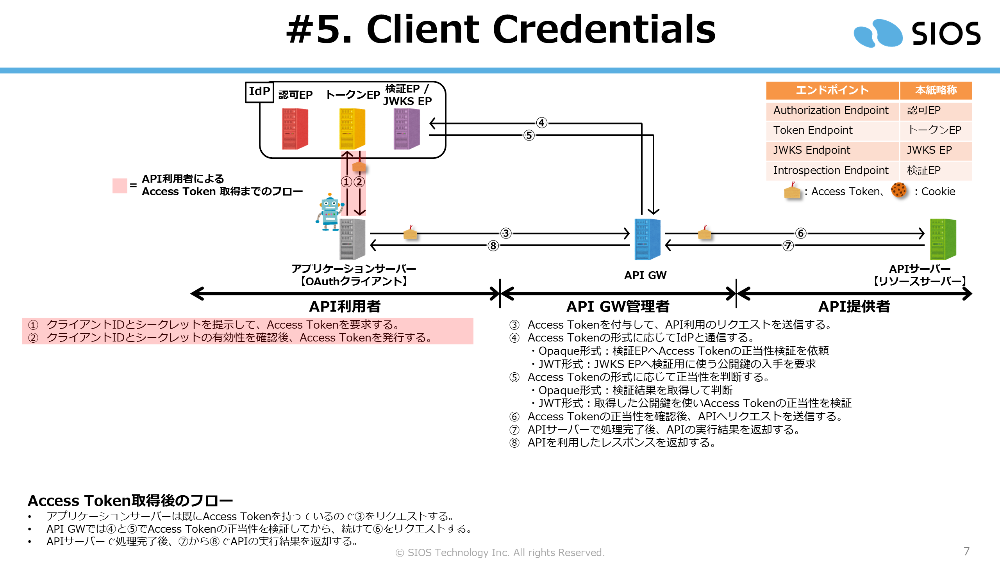

# Kong API Gateway 認可アーキテクチャ体験

[](https://github.com/Toshiharu-Konuma-sti/my-skilling/blob/main/LICENSE)
[](https://github.com/Toshiharu-Konuma-sti/my-skilling/commits/main)
[](https://www.docker.com/)
[](https://konghq.com/products/kong-konnect)
[](https://oauth.net/2.1/)

---

## 目次

1. [はじめに](#1-はじめに)
2. [体験環境の構築手順](#2-体験環境の構築手順)
	- 2-1. [事前準備](#2-1-事前準備)
	- 2-2. [コンテナ構築](#2-2-コンテナ構築)
	- 2-3. [Keycloak 環境設定](#2-3-keycloak-環境設定)
	- 2-4. [Kong Konnect 環境設定](#2-4-kong-konnect-環境設定)
3. [体験](#3-体験)
	- 3-1. [Authorization Code Grant: API Gateway PEP方式](#3-1-authorization-code-grant-api-gateway-pep方式)
	- 3-2. [Authorization Code Grant: OIDC BFF方式](#3-2-authorization-code-grant-oidc-bff方式)
	- 3-3. [Client Credentials](#3-3-client-credentials)
4. [清掃手順](#4-清掃手順)

---

## 1. はじめに

Kong Konnect と Keycloak を使い、主要な認可フローを体験するための環境です。標準的な PEP 方式やトークンを秘匿する BFF 方式など、構成による挙動の差をスクリプトで比較しながら体系的に体験できます。



体験を進める環境は以下の通りです。



## 2. 体験環境の構築手順

### 2-1. 事前準備

Kong Konnectにアクセスして事前準備をします。

1. API Gateway として使用する「Control Plane（CP）」を作り、リージョンと CP 名を手元に控えておきます。

1. 「Personal Access Token（PAT）」を発行して手元に控えておきます。

ローカル環境で事前準備をします。

1. Docker をインストールします。
   - 参考: [初期環境構築: Docker Engine on Ubuntu](https://github.com/Toshiharu-Konuma-sti/setup-docs-for-hands-on/tree/main/setup-docker-engine-on-ubuntu)

1. decK をインストールします。
   - 参考: [decK（Kong Konnect CLI）](../README.md#deckkong-konnect-cli)

1. 体験用スクリプト内のcurlコマンドがホスト名「keycloak」でコンテナへアクセスできるよう、hostsファイルに名前解決用のエントリを登録します。
   - Linux(WSL): /etc/hosts
   - MacOS:      /private/etc/hosts
   - Windows:    C:\Windows\System32\driversc\hosts
     ```
     127.0.0.1 keycloak
     ```

1. 体験用のリポジトリを取得します。

    ```
	$ mkdir -p ~/handson/
    $ cd ~/handson/
    ```
    ```
    $ git clone https://github.com/Toshiharu-Konuma-sti/my-skilling.git
	$ cd ~/handson/my-skilling/kong-konnect/aouth-autorization-grant/
    ```

### 2-2. コンテナ構築

`container/` ディレクトリには2つのスクリプトがあります。

| スクリプト | 概要 |
|---|---|
| [BEFORE_CREATE_CONTAINER.sh](../common/script/BEFORE_CREATE_CONTAINER.sh) | Kong Data Plane 認証用クライアント証明書の作成と Konnect への登録 |
| [CREATE_CONTAINER.sh](./container/CREATE_CONTAINER.sh) | コンテナの構築（Kong DP + Ollama） |

1. `container/` ディレクトリに移ります。

   ```bash
   $ cd ~/handson/my-skilling/kong-konnect/ai-gateway/container/
   ```

1. 事前準備スクリプトを実行します。初回は Konnect の接続情報の入力を求められます。

   ```bash
   $ ./BEFORE_CREATE_CONTAINER.sh

   ⚠️ Konnect Auth file not found: .env-konnect-auth
   ➡️ Create it now? (y/N): y
   🌐 Enter Konnect REGION (us/eu/au/jp): us
   🏢 Enter Target Control Plane Name: my-test-cp001
   🔑 Enter Konnect Personal Access Token:
   ############################################################
   # START SCRIPT
   ############################################################
     :
   ############################################################
   # FINISH SCRIPT (XX seconds)
   ############################################################
   ```

   > 2 回目以降は `.env-konnect-auth` が自動で読み込まれ、入力は不要です。  
   > 接続情報をやり直す場合は `reset` オプションを指定します。
   > ```bash
   > $ ./BEFORE_CREATE_CONTAINER.sh reset
   > ```

1. コンテナ構築スクリプトを実行します。

    ```
	$ ./CREATE_CONTAINER.sh

	############################################################
	# START SCRIPT
	############################################################
	  :
    ```


### 2-3. Keycloak 環境設定

1. 環境設定用のディレクトリに移ります。

    ```
    $ cd ~/handson/setup/
    ```

1. 環境設定スクリプトを実行します。

    ```
	$ ./step01_SETUP_KEYCLOAK.sh

	############################################################
	# START SCRIPT
	############################################################
	  :
    ```
    - 実行内容は [step01_SETUP_KEYCLOAK.sh](./setup/step01_SETUP_KEYCLOAK.sh) の main() 関数に書かれているコメントを確認してください。

### 2-4. Kong Konnect 環境設定

1. 環境設定用のディレクトリに移ります。

    ```
    $ cd ~/handson/setup/
    ```

1. 環境設定スクリプトを実行します。

    ```
	$ ./step02_KONG_REGISTER_API.sh

    🏢 Enter REGION (Control Plane Region): us
    🏢 Enter CP_NAME (Control Plane Name): my-test-cp001
    🔑 Enter KONNECT_PAT (Secret):
	############################################################
	# START SCRIPT
	############################################################
	  :
    ```
    - 実行内容は [step02_KONG_REGISTER_API.sh](./setup/step02_KONG_REGISTER_API.sh) の main() 関数に書かれているコメントを確認してください。

## 3. 体験

1. 体験用のディレクトリに移ります。

    ```
    $ cd ~/handson/try-my-hand/
    ```

### 3-1. Authorization Code Grant: API Gateway PEP方式



本Grantを体験するために、事前に以下OASをKong Konnect環境構築で適用しています。

- [oauth-auth-code-api-gw-pep-oas.yaml](./setup/oauth-auth-code-api-gw-pep-oas.yaml)

図に示したAccess Token発行フローを、curlコマンドを用いたスクリプトで体験することができます。

- [test01_auth-code-api-gw-pep.sh](./try-my-hand/test01_auth-code-api-gw-pep.sh)

    ```
    $ ./test01_auth-code-api-gw-pep.sh
    ```
    - 実行内容は該当スクリプトの main() 関数に書かれているコメントを確認してください。


### 3-2. Authorization Code Grant: OIDC BFF方式



本Grantを体験するために、事前に以下OASをKong Konnect環境構築で適用しています。

- [oauth-auth-code-oidc-bff-oas.yaml](./setup/oauth-auth-code-oidc-bff-oas.yaml)
- [oauth-bff-login-oas.yaml](./setup/oauth-bff-login-oas.yaml)

図に示したAccess Token発行フローを、curlコマンドを用いたスクリプトで体験することができます。

- [test02_auth-code-oidc-bff.sh](./try-my-hand/test02_auth-code-oidc-bff.sh)

  ```
  $ ./test02_auth-code-oidc-bff.sh
  ```
  - 実行内容は該当スクリプトの main() 関数に書かれているコメントを確認してください。

### 3-3. Client Credentials



本Grantを体験するために、事前に以下OASをKong Konnect環境構築で適用しています。

- [oauth-client-credentials-oas.yaml](./setup/oauth-client-credentials-oas.yaml)

図に示したAccess Token発行フローを、curlコマンドを用いたスクリプトで体験することができます。

- [test03_client-credentials.sh](./try-my-hand/test03_client-credentials.sh)

  ```
  $ ./test03_client-credentials.sh
  ```
  - 実行内容は該当スクリプトの main() 関数に書かれているコメントを確認してください。

## 4. 清掃手順

1. 環境構築用のディレクトリに移ります。

    ```
    $ cd ~/handson/setup/
    ```

1. KonnectからCPに登録されている全てのルートとサービスの削除スクリプトを実行します。

    ```
	$ ./teardn_KONG_CLEANUP_ALL_ENTITIES_IN_CP.sh

    🏢 Enter REGION (Control Plane Region): us
    🏢 Enter CP_NAME (Control Plane Name): my-test-cp001
    🔑 Enter KONNECT_PAT (Secret):
	############################################################
	# START SCRIPT
	############################################################
	  :
    ```

1. コンテナ構築用のディレクトリに移ります。

    ```
    $ cd ~/handson/container/
    ```

1. コンテナ停止スクリプトを実行します。

    ```
	$ ./CREATE_CONTAINER.sh down

	############################################################
	# START SCRIPT
	############################################################
	  :
    ```

1. ローカル環境のhostsに登録したkeycloakを解除する
    ```
    # 127.0.0.1 keycloak
    ```
