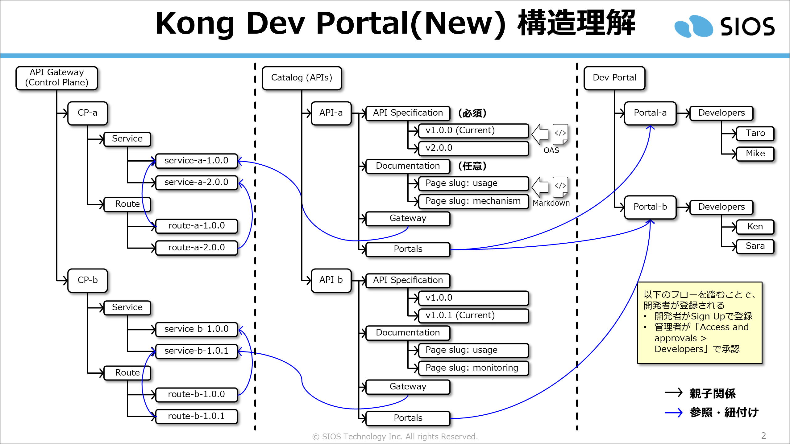

# Kong Dev Portal 体験

[](https://github.com/Toshiharu-Konuma-sti/my-skilling/blob/main/LICENSE)
[](https://github.com/Toshiharu-Konuma-sti/my-skilling/commits/main)
[](https://konghq.com/products/kong-konnect)

---

## 目次

1. [はじめに](#1-はじめに)
2. [体験環境の構築手順](#2-体験環境の構築手順)
   - [2-1. 事前準備](#2-1-事前準備)
   - [2-2. Dev Portal の作成](#2-2-dev-portal-の作成)
   - [2-3. Gateway の登録](#2-3-gateway-の登録)
   - [2-4. Catalog API の登録](#2-4-catalog-api-の登録)
3. [Dev Portal の体験](#3-dev-portal-の体験)
4. [清掃手順](#4-清掃手順)

---

## 1. はじめに

Kong Konnect の **Dev Portal** 機能を体験するためのデモ環境です。

用意されたスクリプトを順番に実行するだけで Dev Portal の自動構築が行われ、以下の内容を実機で体験・理解できます。

* **Konnect 上での設定構造の理解**: `[Dev Portal > Portals]` メニュー内で、どのような構成やオブジェクトが必要となるのかを実際に確認できます。
* **デプロイされたポータルへのアクセス**: Konnect から払い出される実際の公開用 URL を使用して、デプロイ後の Dev Portal へアクセスし、ユーザー目線でのUI/UXを体験できます。

Kong Dev Portal の構造概要図です。



構築する環境の概要は以下のとおりです。

| 対象 | 内容 |
|---|---|
| Dev Portal | `portal/portal.json` の設定をもとに作成。カスタムデザイン・ロゴ・ホームページを適用します。 |
| Gateway Service / Route | `api001/yj-topics-top-oas.yaml`（OAS）を decK で Kong Konnect に登録します。 |
| Catalog API | Konnect の API カタログにサービスを登録し、OAS ドキュメントおよびドキュメントページを公開します。 |

---

## 2. 体験環境の構築手順

### 2-1. 事前準備

#### Kong Konnect での準備

1. API Gateway に該当する **Control Plane（CP）** を作成し、リージョンと CP 名を手元に控えておきます。
2. **Personal Access Token（PAT）** を発行して手元に控えておきます。

#### ローカル環境での準備

1. **decK** をインストールします。

   - 参考: [https://developer.konghq.com/deck/](https://developer.konghq.com/deck/)

   ```bash
   $ curl -LO https://github.com/Kong/deck/releases/download/v1.55.0/deck_v1.55.0_amd64.deb
   $ sudo dpkg -i ./deck_v1.55.0_amd64.deb
   $ deck version
     decK v1.55.0 (19a389c)
   ```

2. **curl / jq / awk** がインストールされていることを確認します。

   ```bash
   $ curl --version
   $ jq --version
   $ awk --version
   ```

3. 体験用のリポジトリを取得します。

   ```bash
   $ mkdir -p ~/handson/
   $ cd ~/handson/
   $ git clone https://github.com/Toshiharu-Konuma-sti/my-skilling.git
   $ cd ~/handson/my-skilling/kong-konnect/dev-portal/setup/
   ```

---

### 2-2. Dev Portal の作成

1. `setup/` ディレクトリに移ります。

   ```bash
   $ cd ~/handson/my-skilling/kong-konnect/dev-portal/setup/
   ```

2. Dev Portal 作成スクリプトを実行します。  
   初回実行時は Konnect の接続情報（リージョン・CP 名・PAT）の入力を求められます。

   ```bash
   $ ./step01_CREATE_DEV_PORTAL.sh

   ⚠️ Konnect Auth file not found: .env-konnect-auth
   ➡️ Create it now? (y/N): y
   🌐 Enter Konnect REGION (us/eu/au/jp): us
   🏢 Enter Target Control Plane Name: my-test-cp001
   🔑 Enter Konnect Personal Access Token:
   ############################################################
   # START SCRIPT
   ############################################################
     :
   ############################################################
   # FINISH SCRIPT (XX seconds)
   ############################################################
   ```

   > 2 回目以降は `.env-konnect-auth` ファイルが自動的に読み込まれるため、接続情報の入力は不要です。

3. スクリプトが実行する内容は [step01_CREATE_DEV_PORTAL.sh](setup/step01_CREATE_DEV_PORTAL.sh) の `main()` 関数に書かれているコメントを確認してください。

   | ステップ | 内容 |
   |---|---|
   | Step 1 | 既存 Dev Portal の一覧を取得し、重複を確認 |
   | Step 2 | Dev Portal の新規作成（POST）または更新（PATCH） |
   | Step 3 | `portal/design.json` をもとにカスタムデザインを更新 |
   | Step 4 | `portal/logo.png` / `portal/favicon.png` をアップロード |
   | Step 5 | `portal/home.html` をホームページとして適用 |

---

### 2-3. Gateway の登録

1. `setup/` ディレクトリに移ります。

   ```bash
   $ cd ~/handson/my-skilling/kong-konnect/dev-portal/setup/
   ```

2. Gateway 登録スクリプトを実行します。

   ```bash
   $ ./step02_REGISTER_GATEWAY.sh

   ############################################################
   # START SCRIPT
   ############################################################
     :
   🎉 全ての Gateway 登録プロセスが正常に終了しました！
   ############################################################
   # FINISH SCRIPT (XX seconds)
   ############################################################
   ```

3. スクリプトが実行する内容は [step02_REGISTER_GATEWAY.sh](setup/step02_REGISTER_GATEWAY.sh) の `main()` 関数に書かれているコメントを確認してください。

   | ステップ | 内容 |
   |---|---|
   | Step 1 | `deck gateway ping` で接続確認 |
   | Step 2 | `api001/*-oas.yaml` を `deck file openapi2kong` で Kong 設定ファイルに変換 |
   | Step 3 | `deck gateway validate` で設定ファイルの書式を確認 |
   | Step 4 | `deck gateway apply` で Konnect へ設定を適用 |

   対象の OAS ファイルは以下のとおりです。

   - [api001/yj-topics-top-oas.yaml](setup/api001/yj-topics-top-oas.yaml)

---

### 2-4. Catalog API の登録

1. `setup/` ディレクトリに移ります。

   ```bash
   $ cd ~/handson/my-skilling/kong-konnect/dev-portal/setup/
   ```

2. Catalog API 登録スクリプトを実行します。

   ```bash
   $ ./step03_REGISTER_CATALOG_API.sh

   ############################################################
   # START SCRIPT
   ############################################################
     :
   🎉 全ての Catalog API 登録プロセスが正常に終了しました！
   ############################################################
   # FINISH SCRIPT (XX seconds)
   ############################################################
   ```

3. スクリプトが実行する内容は [step03_REGISTER_CATALOG_API.sh](setup/step03_REGISTER_CATALOG_API.sh) の `main()` 関数に書かれているコメントを確認してください。

   | ステップ | 内容 |
   |---|---|
   | Step 1 | Control Plane ID の取得 |
   | Step 2 | Catalog API の検索（存在しなければ新規作成） |
   | Step 3 | Gateway Service ID の取得 |
   | Step 4 | Catalog API と Gateway Service の紐付け |
   | Step 5 | OAS ファイルを API Specification として登録 |
   | Step 6 | ドキュメントページ（Markdown）を登録 |

   登録対象の API 設定ファイルは以下のとおりです。

   | ファイル | 内容 |
   |---|---|
   | [api001/yj-topics-top-api.json](setup/api001/yj-topics-top-api.json) | Catalog API のメタ情報（名前・説明） |
   | [api001/yj-topics-top-oas.yaml](setup/api001/yj-topics-top-oas.yaml) | OAS（API Specification として登録） |
   | [api001/yj-topics-top-doc-mechanism.json](setup/api001/yj-topics-top-doc-mechanism.json) / [.md](setup/api001/yj-topics-top-doc-mechanism.md) | ドキュメント「仕組み」 |
   | [api001/yj-topics-top-doc-usage.json](setup/api001/yj-topics-top-doc-usage.json) / [.md](setup/api001/yj-topics-top-doc-usage.md) | ドキュメント「使い方」 |

---

## 3. Dev Portal の体験

詳細の手順は割愛しますが、Kong Konnect へアクセスして確認や体験してください

- Kong Konnect: https://cloud.konghq.com

---

## 4. 清掃手順

1. `setup/` ディレクトリに移ります。

   ```bash
   $ cd ~/handson/my-skilling/kong-konnect/dev-portal/setup/
   ```

2. Catalog API および Gateway Service・Routes の削除スクリプトを実行します。

   ```bash
   $ ./step09_CLEANUP_DEV_PORTAL.sh

   ############################################################
   # START SCRIPT
   ############################################################
     :
   🎉 Catalog API の削除処理が完了しました！
     :
   ############################################################
   # FINISH SCRIPT (XX seconds)
   ############################################################
   ```

   スクリプトが削除する内容は以下のとおりです。

   | フェーズ | 内容 |
   |---|---|
   | Phase 1 | `api001/*-api.json` をもとに Catalog API を削除 |
   | Phase 2 | `api001/*-oas.yaml` をもとに Gateway Service および Routes を削除 |
   | Phase 3 | `portal/portal.json` の名前をもとに Dev Portal 自体を削除 |
