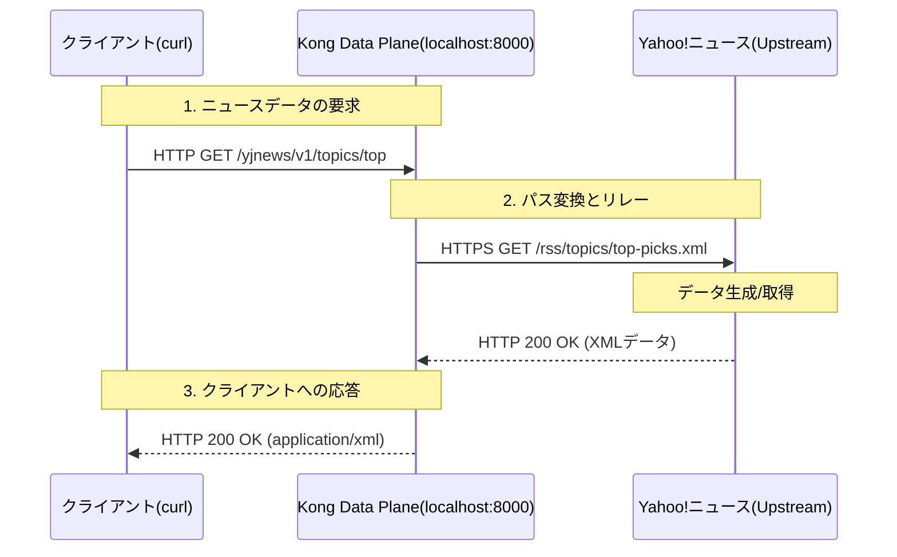

## ⚙️ 仕組み (Mechanism & Architecture)

このセクションでは、クライアントから送信されたリクエストが、Kong Gatewayを通じてどのように処理され、上流サーバー（Yahoo!ニュース）へ到達するかを解説します。

---

### 1. リクエストのルーティングとマッピング

Kong Gatewayは、受信したリクエストのURLパスを解析し、適切なバックエンドサービスへ転送します。本APIでは、パスの抽象化（書き換え）を行っています。

| 項目 | Kongへの入り口 (Proxy) | 実際の接続先 (Upstream) |
| :--- | :--- | :--- |
| **ホスト/ドメイン** | `localhost:8000` | `news.yahoo.co.jp:443` |
| **URLパス** | `/yjnews/v1/topics/top` | `/rss/topics/top-picks.xml` |
| **プロトコル** | `http` | `https` |

> 💡 **Strip Path設定について**
> Kongの `strip_path: true` 機能により、クライアントが指定した `/yjnews/v1/topics/top` というパスは転送前に削除されます。その結果、バックエンド（Yahoo!側）には純粋な `/rss/topics/top-picks.xml` のみが送信され、正しいデータ取得が可能になります。

---

### 2. データフロー・シーケンス

以下の図は、クライアントからのリクエストがレスポンスとして返却されるまでの標準的な流れを示しています。

